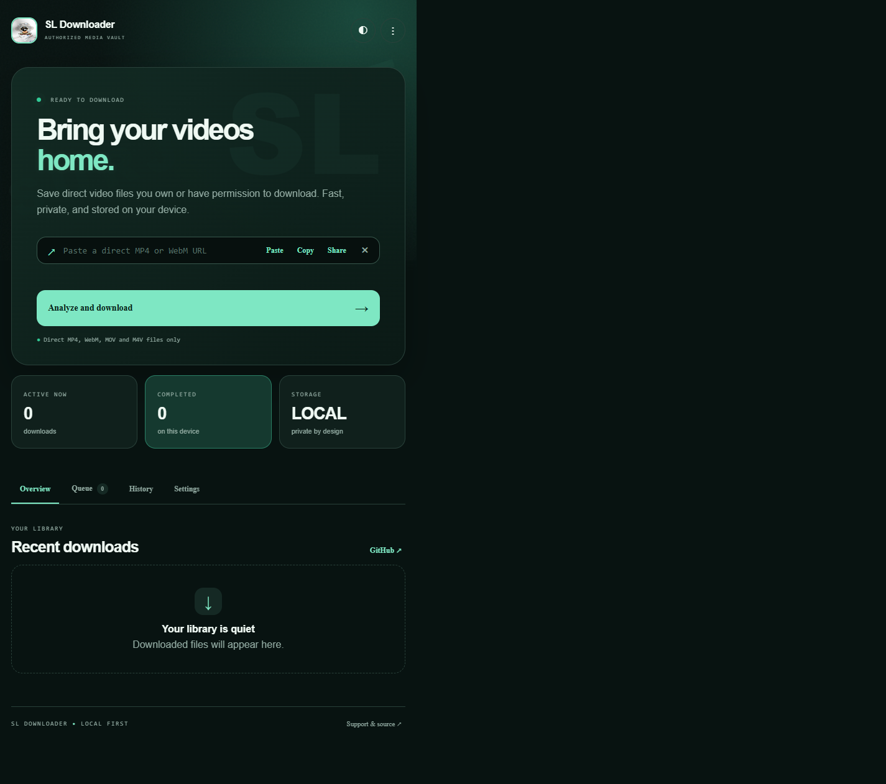
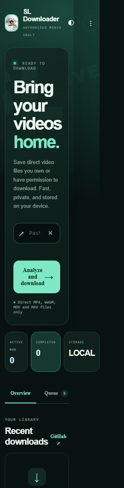

# SL Downloader

<p align="center">
  <strong>Private, focused downloading for authorized direct video files.</strong><br>
  MP4, WebM, MOV, M4V and OGV support on Android 8.0+
</p>

<p align="center">
  <a href="https://github.com/surjolive/SL-Downloader/releases"></a>
  <a href="https://github.com/surjolive/SL-Downloader/blob/main/LICENSE"></a>
</p>

## Download

> **Preview build:** this APK is debug-signed for testing. Install only if you trust the source and understand that Android may show a debug-install warning. A production release requires a user-managed signing key.

<div align="center">

### [Download SL Downloader v1.0.0 Preview](https://github.com/surjolive/SL-Downloader/releases/download/v1.0.0-preview/app-debug.apk)

[View release notes and SHA-256 checksum](https://github.com/surjolive/SL-Downloader/releases/tag/v1.0.0-preview)

</div>

**Preview checksum (SHA-256):**

```text
265da539dd462a1dd6658b28f16de77c460eaf87372b4550dbb6cb5214c087f5
```

## What it does

SL Downloader is a local-first Android application for downloading direct video files that the user owns or is explicitly authorized to save. It validates URLs before network access, streams files without loading them into memory, and writes them to the device's Movies library.
It recognizes common YouTube and social-media page URLs so the app can explain why a page URL is not a downloadable file.

The app does **not** extract videos from platform pages. A YouTube, Vimeo, social-media, private, DRM-protected, paywalled, or login-only page is not a direct media URL and is intentionally rejected.
Use an official download/export link supplied by the platform or a direct media URL for content you are authorized to save.

## Features

- Premium responsive HTML/CSS/JavaScript interface bundled inside the Android app
- Kotlin Android bridge for clipboard, sharing, downloads, and GitHub support
- Paste, copy, clear, and share URL workflows
- Direct URL validation for HTTP and HTTPS media files
- MP4, WebM, MOV, M4V and OGV extension support
- YouTube and Vimeo page URL rejection
- Retry handling for temporary network and server failures
- Friendly errors for 401, 403, 404, 429, 5xx, timeout, and invalid media responses
- Streaming buffered downloads with MediaStore output
- Android 8 and 9 legacy storage compatibility
- Android 10+ scoped storage in `Movies/SL Downloader`
- Local queue persistence with remove and clear actions
- Queue search and status filters
- Local history view
- Light and dark themes with persistent preference
- Reduced-motion preference
- Three-dot quick actions menu
- GitHub profile and support links
- English and Bangla resource support
- Foreground download service and notification channel foundation
- Room database records for download history

## Screens and workflows

### Screenshots

The screenshots below show the bundled SL Downloader interface at desktop and mobile viewport sizes. The Android app loads this same local HTML/CSS/JavaScript surface inside its WebView.

| Desktop | Mobile |
| --- | --- |
|  |  |

### Home

Paste or type an authorized direct media URL, copy it, share it, or start a download. The home screen shows active and completed counts, animated status feedback, and recent queue items.

### Queue

Search queued items, filter by status, remove individual entries, or clear the queue.

### History

Review locally stored download records and clear local history when needed.

### Settings

Change appearance behavior, reduce motion, open GitHub support, and read the authorized-use and privacy policy.

## Authorized-download policy

Use this app only for media you own, have created, or have permission to download from a service that explicitly allows it.

The project does not implement or support:

- DRM circumvention
- CAPTCHA bypass
- Paywall bypass
- Private-content extraction
- Authentication, cookie, or token theft
- Platform restriction bypass
- Hidden scraping or credential collection
- Executable-file downloads or execution

## Privacy and security

SL Downloader is designed to operate locally. It does not include analytics, advertising SDKs, hidden tracking, remote URL collection, cookie storage, token storage, or uploaded media.

Security measures include:

- HTTP/HTTPS URL validation
- Direct-media extension and response-type checks
- Filename sanitization
- No path traversal support
- No arbitrary code execution
- Cleartext traffic disabled
- Scoped MediaStore storage on modern Android
- Minimal declared permissions

## Architecture

```text
HTML/CSS/JavaScript UI
          |
          v
Android WebView bridge
          |
          v
HomeViewModel -> DownloadRepository
                         |
             +-----------+-----------+
             |                       |
          Room database        MediaStore / HTTP
```

The Android module keeps native responsibilities in Kotlin. The presentation layer is a local WebView bundle so the visual interface can evolve independently through HTML, CSS, and JavaScript without loading remote web content.

## Technology

- Kotlin 2.2.20
- Android Gradle Plugin 9.3.2
- Android SDK compile/target 37
- Minimum SDK 24 (Android 8.0)
- Jetpack Compose and Material 3 fallback components
- Android WebView for the bundled premium UI
- Kotlin Coroutines and StateFlow
- Room 2.7.2 with KSP
- AndroidX Media3 dependencies
- WorkManager and DataStore dependencies
- MediaStore and scoped storage
- JUnit and AndroidX test libraries

## Project layout

```text
app/src/main/
  assets/
    index.html
    script.js
    style.css
    github-avatar.png
  java/com/sl/videodownloader/
    MainActivity.kt
    data/database/
    data/repository/
    domain/
    presentation/theme/
    service/
    util/
  res/
  AndroidManifest.xml
```

## Requirements

- Android Studio with a bundled JDK
- Android SDK 37 platform and build tools
- Android device or emulator running Android 8.0 or newer
- Internet access only when downloading a remote direct media file

## Build from source

Clone the repository and open the repository root in Android Studio:

```bash
git clone https://github.com/surjolive/SL-Downloader.git
cd SL-Downloader
```

### Debug APK

Windows PowerShell:

```powershell
.\gradlew.bat :app:assembleDebug
```

macOS/Linux:

```bash
./gradlew :app:assembleDebug
```

Output:

```text
app/build/outputs/apk/debug/app-debug.apk
```

### Tests

```bash
./gradlew test
```

On Windows:

```powershell
.\gradlew.bat test
```

### Production release

The repository does not contain a signing key. Create and protect your own upload/release key, configure signing in a private Gradle configuration, and then run:

```bash
./gradlew :app:assembleRelease
./gradlew :app:bundleRelease
```

Never commit keystores, passwords, tokens, or `local.properties`.

## Troubleshooting

**The APK will not install:** uninstall an older package signed with a different key, or use the debug build consistently. The preview APK is debug-signed.

**A URL is rejected:** use the direct URL of an authorized video file. A watch page or login page is not supported.

**The server returns an error:** check permissions, the response status, the URL, network availability, and free storage. Temporary network/server failures are retried automatically.

**Android 8 or 9 cannot save:** grant the requested storage permission and ensure the device has free space.

**Gradle cannot start:** select Android Studio's embedded JDK in Gradle settings and run the wrapper from the repository root.

## License

The application source in this repository is licensed under the MIT License. See [LICENSE](LICENSE).

Third-party libraries remain under their own licenses. This project does not relicense them:

- Kotlin: [Apache License 2.0](https://www.apache.org/licenses/LICENSE-2.0)
- AndroidX and Jetpack Compose: [Apache License 2.0](https://www.apache.org/licenses/LICENSE-2.0)
- Material Components: [Apache License 2.0](https://www.apache.org/licenses/LICENSE-2.0)
- Kotlin Coroutines: [Apache License 2.0](https://www.apache.org/licenses/LICENSE-2.0)
- Room, WorkManager, DataStore, and Media3: [Apache License 2.0](https://www.apache.org/licenses/LICENSE-2.0)
- JUnit: [Eclipse Public License 1.0](https://www.eclipse.org/legal/epl-v10.html)
- AndroidX test and Espresso: [Apache License 2.0](https://www.apache.org/licenses/LICENSE-2.0)

Refer to each dependency's distributed metadata and source repository for complete notices and copyright information.

## Contributions

Issues and pull requests are welcome through [GitHub](https://github.com/surjolive/SL-Downloader). Contributions must preserve the authorized-download policy, local-first privacy model, and Android security restrictions.

- Read [CONTRIBUTING.md](CONTRIBUTING.md) before opening a pull request.
- Follow the [Code of Conduct](CODE_OF_CONDUCT.md) in project discussions.
- Use [SECURITY.md](SECURITY.md) for private vulnerability reports.
- Use the issue templates for reproducible bugs and feature proposals.

## Maintainer

**Surjo Live**

- GitHub: [@surjolive](https://github.com/surjolive)
- Repository: [SL-Downloader](https://github.com/surjolive/SL-Downloader)
